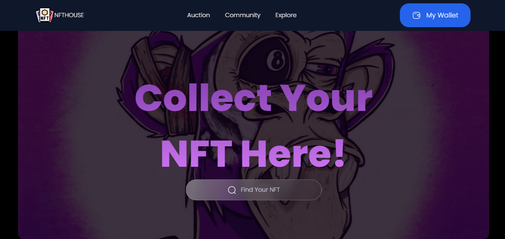

<p align="center">

</p>

# NFT Profile Project

This project is a web-based NFT Profile platform built using HTML, CSS, and JavaScript. It is designed to showcase user profiles along with their NFT collections in a visually appealing and interactive way. The project highlights the core front-end development skills while integrating the concept of NFTs (Non-Fungible Tokens).

## Features

1. **Responsive Design**:
   - Fully responsive layout to ensure compatibility with devices of all screen sizes.

2. **NFT Collection Display**:
   - Showcase of NFTs owned by the user with details such as title, description, and ownership history.

3. **Interactive UI**:
   - Smooth animations and hover effects for a modern look and feel.

## Technologies Used

- **HTML**: Structure of the web pages.
- **CSS**: Styling, including animations and responsive design.
- **JavaScript**: Adding interactivity and handling dynamic content.

## Getting Started

1. **Clone the Repository**:
   ```bash
   git clone https://github.com/leo-lifecode/nfthouse.git
   ```

2. **Open the Project**:
   Navigate to the project folder and open `index.html` in any modern web browser.

3. **Customize**:
   Update the `index.html` file to include your profile and NFT data.

## How to Use

1. **View Profile**:
   The landing page displays the user’s profile with a summary of their NFT collection.

2. **Browse NFTs**:
   Hover over each NFT card to see additional details or click on a card for a detailed view.

## Future Enhancements

- Integration with real blockchain APIs to fetch live NFT data.
- User authentication for personalized profiles.
- Adding filters and sorting for NFT collections.

## Contributing

Contributions are welcome! If you’d like to contribute, please fork the repository and submit a pull request.

## License

This project is licensed under the [MIT License](LICENSE). Feel free to use, modify, and distribute this project as per the terms of the license.

Feel free to explore and customize the NFTHOUSE to match your vision!

